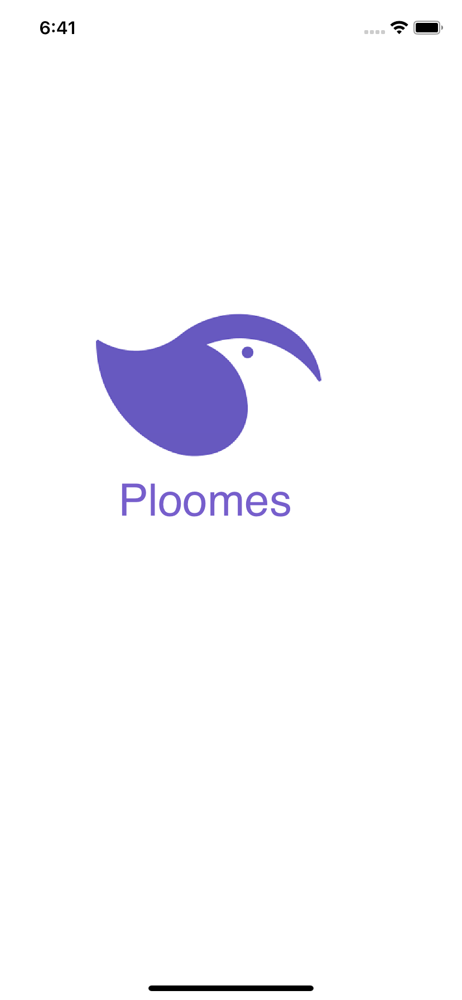
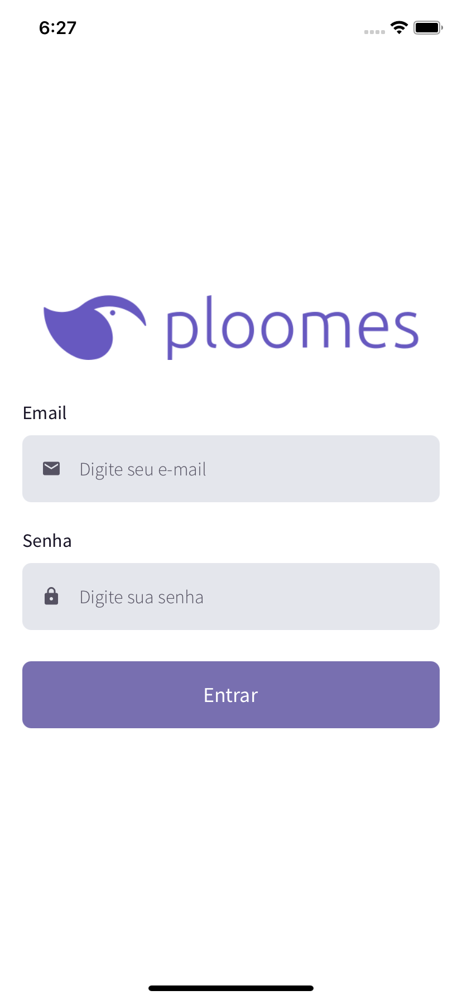
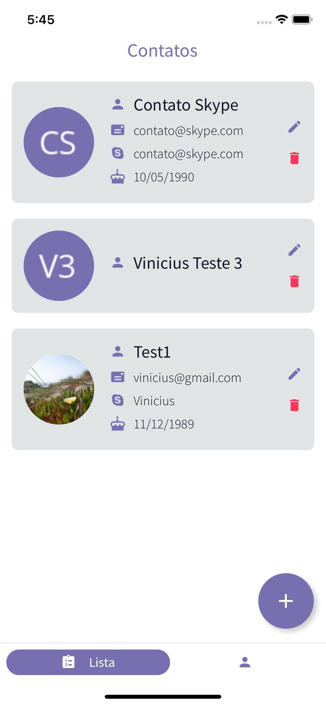
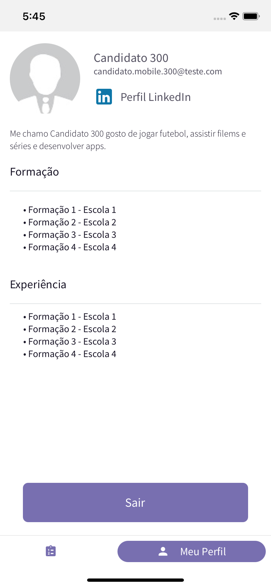
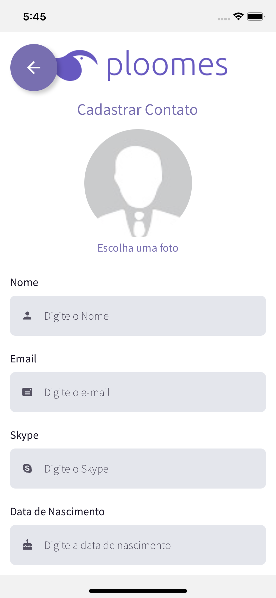
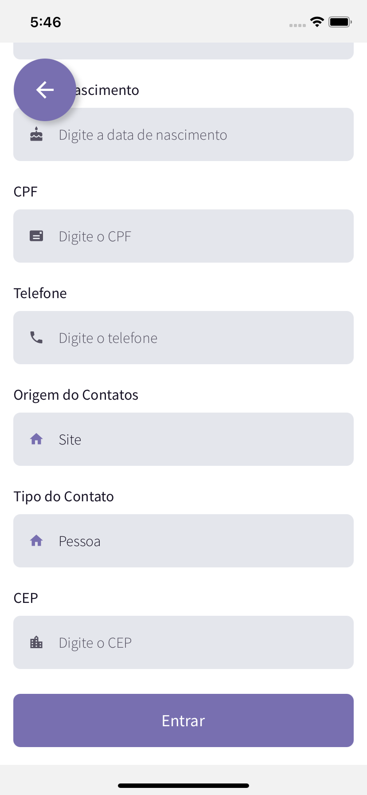
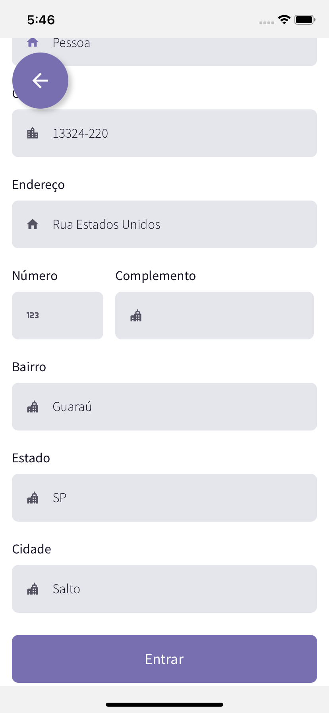
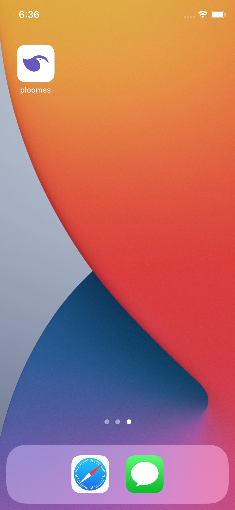

<h1 align="center">
    
</h1>

## 💻 Project

Test Ploomes for React Native Developers.

## :rocket: Technologies

This project was developed with the following technologies:

- [Node.js](https://nodejs.org/en/)
- [React](https://reactjs.org)
- [React Native](https://facebook.github.io/react-native/)
- [Redux](https://redux.js.org/)
- [Firebase](https://rnfirebase.io/)
- [React Native Vector Icons](https://github.com/oblador/react-native-vector-icons)

## :information_source: How To Use

To clone and run this application, you'll need [Git](https://git-scm.com), [Node.js][nodejs] + [Yarn][yarn] installed on your computer.

From your command line:

### Screens

<p align="center">
  
  
  
  
  
  
  
  
</p>

### Install App AndroidƲ

```bash
# Clone this repositoryƲƲ
$ git clone https://github.com/ViniCleFer/ploomes-rn-test.git

# Install dependencies
$ yarn install

# Run the APP
$ yarn android
```

### Install App IOS

```bash
# Clone this repository
$ git clone https://github.com/ViniCleFer/ploomes-rn-test.git

# Install dependencies
$ yarn install && cd ios && pod-install && cd ..

# Run the APP
$ yarn ios
```

[nodejs]: https://nodejs.org/
[yarn]: https://yarnpkg.com/
[vc]: https://code.visualstudio.com/
[vceditconfig]: https://marketplace.visualstudio.com/items?itemName=EditorConfig.EditorConfig
[vceslint]: https://marketplace.visualstudio.com/items?itemName=dbaeumer.vscode-eslint
[prettier]: https://marketplace.visualstudio.com/items?itemName=esbenp.prettier-vscode
